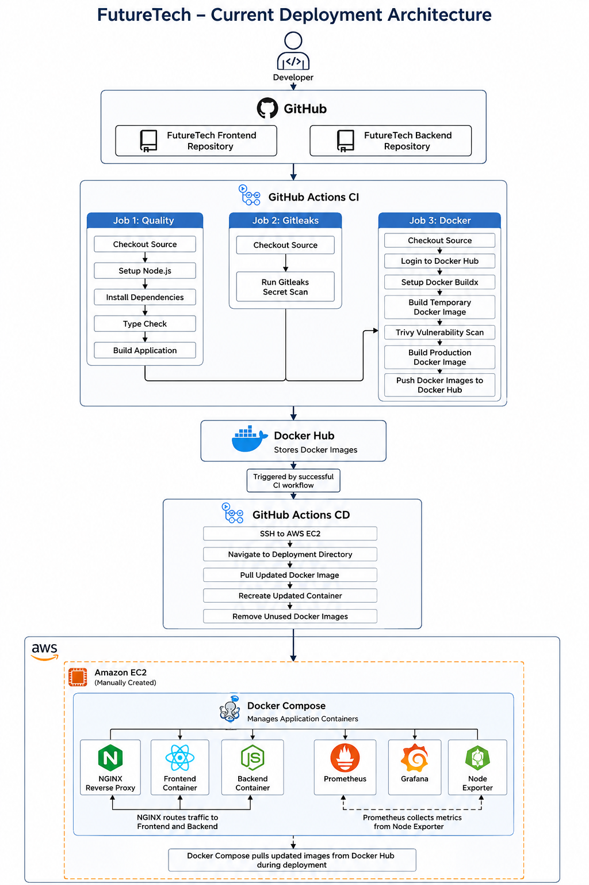
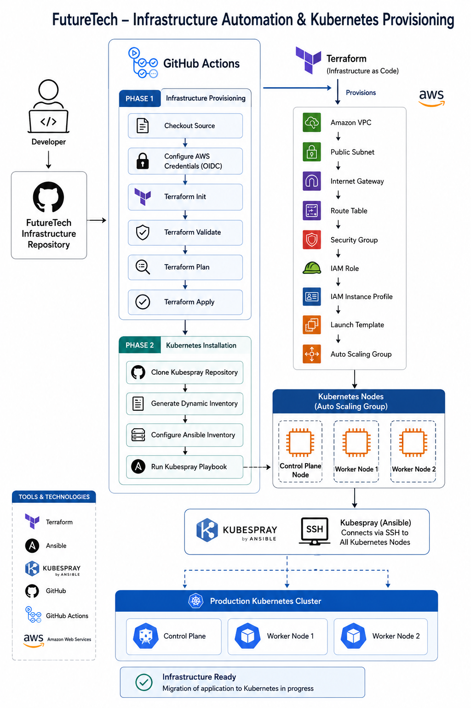
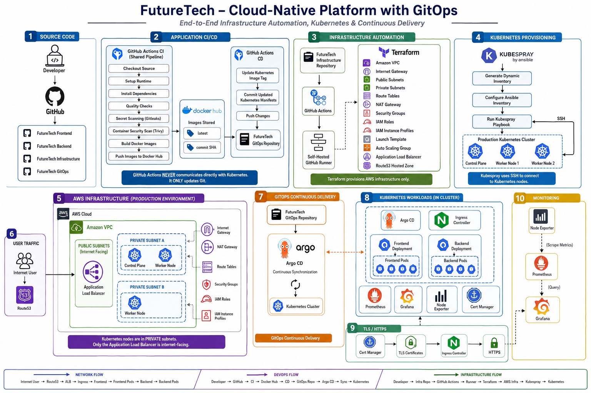

<div align="center">

# FutureTech Labs

> Building a production-oriented cloud-native platform with modern DevOps, Infrastructure as Code, Kubernetes, and GitOps practices.

A multi-repository GitHub organization showcasing end-to-end cloud infrastructure provisioning, CI/CD automation, Kubernetes platform engineering, and GitOps workflows using AWS, Terraform, Kubespray, GitHub Actions, and Argo CD.

<p align="center">
<p align="center">
  <a href="https://aws.amazon.com/" target="_blank"></a>
  <a href="https://www.terraform.io/" target="_blank"></a>
  <a href="https://kubernetes.io/" target="_blank"></a>
  <a href="https://www.docker.com/" target="_blank"></a>
  <a href="https://github.com/features/actions" target="_blank"></a>
  <a href="https://ubuntu.com/" target="_blank"></a>
</p>
</p>

<p align="center">
  <a href="https://nextjs.org/" target="_blank"></a>
  <a href="https://nodejs.org/" target="_blank"></a>
  <a href="https://expressjs.com/" target="_blank"></a>
  <a href="https://www.typescriptlang.org/" target="_blank"></a>
  <a href="https://www.mongodb.com/" target="_blank"></a>
</p>

</div>

---

## Introduction

**FutureTech Labs** is a multi-repository organization built to demonstrate how a real engineering team structures application code, infrastructure, and deployment automation for a cloud-native product.

Rather than a single monolithic project, FutureTech Labs is split into independently owned repositories — application services, infrastructure-as-code, and (eventually) GitOps configuration — mirroring the repository boundaries used by real platform and DevOps teams.

The system currently in place provisions AWS infrastructure with Terraform, bootstraps a self-hosted GitHub Actions runner, and installs a multi-node Kubernetes cluster using Kubespray — all triggered automatically through a single CI/CD pipeline.

> [!NOTE]
> **FutureTech Labs** is an educational and portfolio organization focused on building and documenting production-oriented DevOps, cloud infrastructure, Kubernetes, and GitOps practices. While inspired by real-world engineering patterns, the repositories are developed as a hands-on learning platform to explore modern platform engineering concepts and demonstrate practical implementation.

## Mission

To build and document a complete, working cloud-native platform — from application code to a self-provisioning Kubernetes cluster — using the same tools, patterns, and operational discipline expected in production DevOps and platform engineering roles.

Every repository in this organization is designed to be read, not just run: infrastructure decisions, failure modes, and their resolutions are documented as they're encountered, rather than presented only in a finished state.

---

## Repository Overview

| Repository                                                                      | Purpose                                                      | Technologies                                               | Status         |
| ------------------------------------------------------------------------------- | ------------------------------------------------------------ | ---------------------------------------------------------- | -------------- |
| [`futuretech-frontend`](https://github.com/FutureTech-Labs/futuretech-frontend) | Customer-facing web application                              | Next.js, TypeScript, React, Tailwind CSS, Docker           | Active         |
| [`futuretech-backend`](https://github.com/FutureTech-Labs/futuretech-backend)   | REST API and business logic                                  | Node.js, Express, MongoDB, Docker                          | Active         |
| [`futuretech-infra`](https://github.com/FutureTech-Labs/futuretech-infra)       | Infrastructure provisioning and Kubernetes cluster bootstrap | Terraform, AWS, Kubespray, Ansible, GitHub Actions         | Active         |
| [`futuretech-gitops`](https://github.com/FutureTech-Labs/futuretech-gitops)     | Kubernetes manifests and GitOps configuration                | Kubernetes YAML, Argo CD (planned), Cert-Manager (planned) | In Development |

---

## Repository Relationship

The repositories within **FutureTech Labs** are designed with clear separation of responsibilities, following a structure commonly used in modern software engineering and platform teams.

```
FutureTech-Labs
│
├── futuretech-frontend
│      └── Next.js customer-facing web application
│
├── futuretech-backend
│      └── Express.js REST API and business services
│
├── futuretech-infra
│      └── AWS infrastructure provisioning and Kubernetes cluster automation
│
└── futuretech-gitops
       └── Kubernetes manifests and GitOps configuration
```

---

## Repository Responsibilities

### `futuretech-frontend`

- Next.js application written in TypeScript
- Dockerized for consistent local and production builds
- CI pipeline via GitHub Actions
- Published as a versioned image to Docker Hub

### `futuretech-backend`

- Express.js REST API
- MongoDB for persistence
- Dockerized for consistent local and production builds
- CI pipeline via GitHub Actions
- Published as a versioned image to Docker Hub

### `futuretech-infra`

- Terraform-managed AWS infrastructure: VPC, public and private subnets, Internet Gateway, route tables, security groups, and IAM roles
- Auto Scaling Group and Launch Template provisioning for Kubernetes nodes
- Self-hosted GitHub Actions runner, deployed via Terraform
- Kubespray (Ansible) for automated Kubernetes installation, included as a Git submodule
- A single GitHub Actions pipeline spanning infrastructure provisioning through cluster bootstrap

**Pipeline flow:**

```
GitHub Actions → Terraform → AWS Infrastructure → Kubespray → Kubernetes Cluster
```

### `futuretech-gitops`

Currently holds Kubernetes manifests for workloads deployed to the cluster.

Planned scope:

- Argo CD application definitions
- Environment-separated manifests (staging, production)
- Cert-Manager configuration for TLS
- Monitoring stack manifests (Prometheus, Grafana)
- Full GitOps reconciliation — cluster state driven entirely from this repository

---

## Current Architecture

<p align="left">
  
</p>

---

### Current Infrastructure

<p align="left">
  
</p>

## Planned Future Architecture

```
GitHub
  │
  ├── futuretech-frontend
  ├── futuretech-backend
  ├── futuretech-infra
  └── futuretech-gitops
              │
              ▼
      GitHub Actions
              │
              ▼
          Terraform
              │
              ▼
             AWS
              │
              ▼
          Kubespray
              │
              ▼
            Argo CD
              │
              ▼
       FutureTech-Gitops
              │
              ▼
      Application Deployment
```

### Future GitOps Architecture

<p align="left">
  
</p>

---

## Technology Stack

### Frontend

| Technology   | Purpose                                            |
| ------------ | -------------------------------------------------- |
| Next.js      | React framework, application routing and rendering |
| TypeScript   | Static typing across the application               |
| React        | UI component model                                 |
| Tailwind CSS | Utility-first styling                              |

### Backend

| Technology | Purpose            |
| ---------- | ------------------ |
| Node.js    | JavaScript runtime |
| Express    | REST API framework |
| MongoDB    | Primary datastore  |

### DevOps & Infrastructure

| Technology               | Purpose                                   |
| ------------------------ | ----------------------------------------- |
| AWS                      | Cloud infrastructure provider             |
| Terraform                | Infrastructure as Code                    |
| Docker                   | Application containerization              |
| Kubernetes               | Container orchestration                   |
| Kubespray                | Automated Kubernetes cluster installation |
| GitHub Actions           | CI/CD automation                          |
| GitHub OIDC              | Federated, keyless authentication to AWS  |
| Linux                    | Node and runner operating system          |
| NGINX                    | Reverse proxy                             |
| Argo CD _(planned)_      | GitOps continuous delivery                |
| Prometheus _(planned)_   | Metrics collection                        |
| Grafana _(planned)_      | Observability dashboards                  |
| Cert-Manager _(planned)_ | Automated TLS certificate management      |

---

## CI/CD Workflow

**Application repositories** (`futuretech-frontend`, `futuretech-backend`):

```
Push to main
      │
      ▼
GitHub Actions CI
      │
      ▼
Build Docker Image
      │
      ▼
Push to Docker Hub
```

**Infrastructure repository** (`futuretech-infra`):

```
Push to main (or manual dispatch)
      │
      ▼
Terraform init → validate → plan → apply
      │
      ▼
Provision VPC, Security Groups, ASG, Launch Template
      │
      ▼
Discover Kubernetes node IPs (AWS tag-based query)
      │
      ▼
Generate Kubespray inventory
      │
      ▼
Run Kubespray → install Kubernetes + Calico CNI
```

All infrastructure-affecting workflows authenticate to AWS via GitHub OIDC — no long-lived AWS credentials are stored as repository secrets.

---

## Infrastructure Overview

Infrastructure is provisioned entirely through Terraform and organized around a single Auto Scaling Group of EC2 instances that form the Kubernetes cluster, alongside a dedicated self-hosted GitHub Actions runner used to execute Ansible/Kubespray against the cluster nodes over SSH.

Security Groups are scoped per Kubernetes component rather than opened broadly — separate ingress rules exist for the API server, etcd, kubelet, controller-manager, scheduler, the NodePort range, and Calico's VXLAN overlay — with all inter-node traffic restricted to members of the same security group.

Kubespray, included as a Git submodule, handles the full cluster bootstrap: container runtime installation, control-plane initialization, worker join, and CNI (Calico) deployment — triggered automatically once Terraform provisioning completes.

---

## Learning Roadmap

- [x] Containerize frontend and backend applications
- [x] Build CI pipelines for image build and publish
- [x] Provision AWS networking and compute with Terraform
- [x] Deploy a self-hosted GitHub Actions runner via Terraform
- [x] Automate Kubernetes cluster installation with Kubespray
- [x] Scope Security Groups to least-privilege, per Kubernetes component
- [ ] Deploy application workloads onto the cluster
- [ ] Introduce Argo CD and GitOps-driven deployments
- [ ] Add Prometheus and Grafana for cluster and application observability
- [ ] Automate TLS with Cert-Manager
- [ ] Split control-plane and worker nodes into separate Auto Scaling Groups
- [ ] Introduce control-plane high availability (multi-node etcd)
- [ ] Handle ASG node replacement without manual pipeline re-runs

## Future Enhancements

- Dedicated control-plane Auto Scaling Group with role-based tagging for deterministic node identity
- Multi-node control-plane for high availability
- Event-driven node recovery (ASG lifecycle hooks triggering automatic Kubespray re-runs)
- Full GitOps delivery via Argo CD watching `futuretech-gitops`
- Centralized observability with Prometheus and Grafana
- Automated certificate issuance and renewal via Cert-Manager

---

## Contribution

FutureTech Labs is currently maintained as a personal portfolio and learning project. Feedback, suggestions, bug reports, and discussions are welcome through the individual repositories.

## License

Unless otherwise specified, all repositories within this organization are released under the MIT License. Refer to the `LICENSE` file in each repository for details.

## Contact

If you'd like to discuss the project, provide feedback, or connect professionally, feel free to reach out through any of the following channels.

- **GitHub:** https://github.com/FutureTech-Labs
- **LinkedIn:** https://www.linkedin.com/in/y-n-muhammadhashir

For repository-specific bugs, feature requests, or technical discussions, please open an issue in the relevant repository.

---

<div align="center">

<sub><strong>FutureTech Labs</strong> • Building production-oriented cloud infrastructure, Kubernetes platforms, and modern DevOps automation.</sub>

</div>
